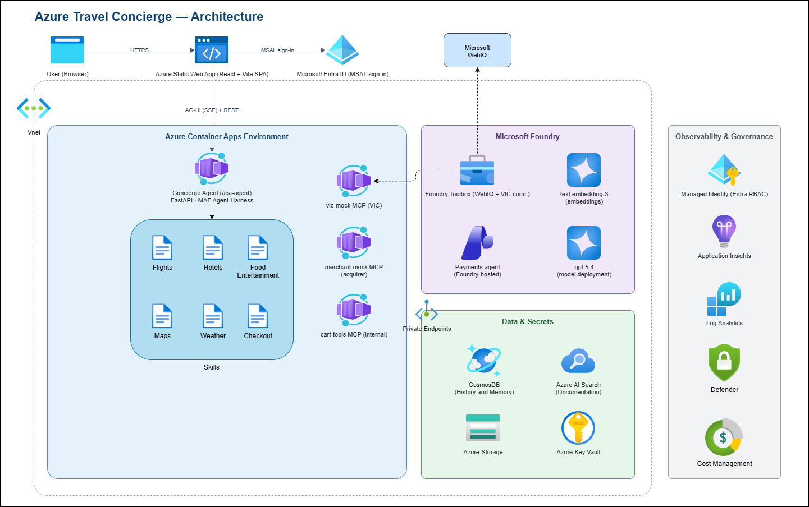

# Azure Travel Concierge Agent

An **Azure AI Foundry** re-implementation of the AWS Bedrock AgentCore
[travel-concierge-agent](https://github.com/aurbac/amazon-bedrock-agentcore-samples/tree/main/05-blueprints/travel-concierge-agent)
blueprint, built entirely with Microsoft & Azure products:

- **Microsoft Agent Framework 1.12** — the **Agent Harness** orchestrates
  file-based skills (`flights`, `hotel-booking`, `food-entertainment`, `maps`,
  `weather`, `checkout`), performed with the WebIQ-backed **Foundry Toolbox**
- **Azure AI Foundry** (`gpt-5.4` + embeddings) as the model backbone, plus a
  **Foundry-hosted Payments agent** (visible in the portal) that consumes a
  **Foundry Toolbox** wrapping the mock VIC to complete purchases
- **Azure AI Search** — a `documentation` index populated by the
  search-ingestion pipeline (provisioned infrastructure; not queried by the
  agent at runtime)
- **Azure Cosmos DB for NoSQL** — cart / profile / orders, **named
  multi-itineraries**, and per-itinerary chat memory (`CosmosHistoryProvider`)
- **Azure Container Apps** for the agent and MCP tool servers
- **Azure Static Web Apps** + **Entra ID** for the React chat UI, which talks to
  the agent over the **AG-UI protocol** (custom SSE reader ↔ FastAPI `/agui`),
  including human-in-the-loop tool-approval interrupts
- **Terraform** (azurerm + azapi + azuread) for all infrastructure
- Self-contained **mock VIC (Visa)** and **mock merchant** MCP servers that mirror
  the real agentic-commerce boundary (no external VIC access required)

## Architecture



> Editable source: [`docs/architecture.drawio`](docs/architecture.drawio) — open
> in [diagrams.net](https://app.diagrams.net) or the VS Code Draw.io Integration
> extension. See [`docs/ARCHITECTURE.md`](docs/ARCHITECTURE.md) for detail.

## Repository layout

```
agents/concierge_agent/   Supervisor agent (FastAPI + Microsoft Agent Framework)
  skills/                 File-based Harness skills (SKILL.md per subfolder)
mcp-servers/
  travel-tools/           MCP: destination / flight / hotel search
  cart-tools/             MCP: cart, itinerary, checkout (Cosmos + VIC + merchant)
  vic-mock/               MCP: mock VIC (Visa) tokenization / mandates / credentials
  merchant-mock/          MCP: mock merchant / acquirer — settles VIC credentials, creates orders
search-ingestion/         Push visa docs into Azure AI Search
web-ui/                   React + Vite SPA (chat, cart, itinerary, card modal)
terraform/                All Azure infrastructure as code
scripts/                  build-images.sh, deploy.sh, deploy-webui.sh, seed_demo_data.py
docs/                     ARCHITECTURE / DEPLOYMENT / AGENT_CAPABILITIES
```

## Quick start

```bash
export GH_REPO="your-org/travel-concierge-azure"
az login
./scripts/deploy.sh          # build images -> terraform apply -> seed -> ingest -> deploy UI
```

`deploy.sh` also builds and publishes the React UI to the Static Web App. To
(re)deploy just the UI later, run `./scripts/deploy-webui.sh` (see
[docs/DEPLOYMENT.md](docs/DEPLOYMENT.md#4-build--deploy-the-web-ui)).

## Documentation

- [Architecture](docs/ARCHITECTURE.md) — components, AWS→Azure mapping, data & payment flows
- [Deployment](docs/DEPLOYMENT.md) — prerequisites and step-by-step provisioning
- [Agent Capabilities](docs/AGENT_CAPABILITIES.md) — full agent + MCP tool catalog

## Design highlights

- **Agent Harness (MAF 1.12)** — a single supervisor harness performs
  **file-based skills** (progressive-disclosure `SKILL.md` files under
  `agents/concierge_agent/skills/`) using the shared Foundry Toolbox, and
  delegates purchases to a Foundry-hosted payments agent, with a persisted,
  per-itinerary conversation thread backed by `CosmosHistoryProvider`.
- **Named multi-itineraries** — each user can create, switch between, and delete
  named itineraries; every itinerary has its own chat history and saved plan.
- **Keyless by default** — Cosmos, Foundry, and AI Search have local auth
  disabled, and the Storage account has shared access keys disabled; all access
  flows through a User-Assigned Managed Identity with Entra RBAC role
  assignments.
- **Private networking** — Cosmos DB, Storage and Key Vault have public network
  access disabled and are reached over private endpoints from the VNet-injected
  Container Apps environment. AI Search connects to Storage via a shared private
  link (its private endpoint connection must be approved once before ingestion).
- **Card data never reaches the LLM** — card capture is a direct REST → MCP path
  to the (mock) tokenization service; the model only ever sees a token / last-4.
- **Fully mockable demo** — the mock VIC MCP server and deterministic travel
  data make the whole experience runnable without any third-party credentials.

### Configuring the skills & payments agent

Set these in `terraform/terraform.tfvars` (see the sample):

- `foundry_toolbox_name` — the Foundry Toolbox (default
  `travel-concierge-toolbox`) that bundles **WebIQ** (web intelligence, used by
  the Flights, Hotel Booking and Food & Entertainment skills) and the **VIC**
  payment tools behind one MCP endpoint. Consumed with centralized AAD auth.
- `foundry_toolbox_version` — optional version pin. When blank, the Toolbox's
  default version is resolved at startup.
- `payments_agent_name` — the Foundry-hosted Payments agent (visible in the
  Foundry portal) that consumes the Toolbox's VIC tools. When the Toolbox is not
  configured the skills fall back to Foundry web search and payments falls back
  to a local cart/VIC MCP sub-agent.

> **Note:** the VIC integration here is a **mock** for demonstration only and
> performs no real payment processing.
